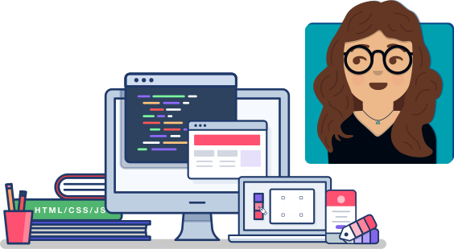

&nbsp;

# ¡Hola Mundo! 👋 Ximena here…

## 🎨 💻 &nbsp; Designer and developer working to design and build better, accessible web experiences

&nbsp;

📚 &nbsp; Learning:

- Refining HTML & CSS skills
- Javascript
- Accessibility
- React

🍇 &nbsp; Currently obsessed with the [Jamstack](https://jamstack.org/link), [Netlify](https://netlify.com), and everything related!

👩 &nbsp; Volunteering at [AIGA San Antonio](https://sanantonio.aiga.org/) as Chapter President.

⭐ &nbsp; Working to bridge the communication gap between designers and developers.

👩 &nbsp; She/Her

🇲🇽 &nbsp;🇺🇸 &nbsp; Mexican born, Texas based

🏠 &nbsp; [Website](https://ximenavf.com) &nbsp; | &nbsp; 💬 &nbsp; [RWC Discord Hangout](https://www.patreon.com/cassidoo/posts)

<!--
**ximenavf92/ximenavf92** is a ✨ _special_ ✨ repository because its `README.md` (this file) appears on your GitHub profile.

Here are some ideas to get you started:

- 🔭 I’m currently working on ...
- 🌱 I’m currently learning ...
- 👯 I’m looking to collaborate on ...
- 🤔 I’m looking for help with ...
- 💬 Ask me about ...
- 📫 How to reach me: ...
- 😄 Pronouns: ...
- ⚡ Fun fact: ...
-->
